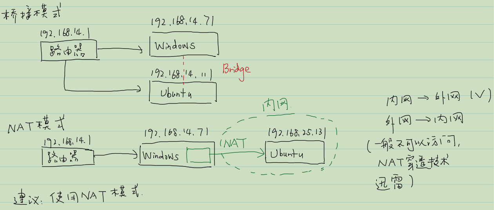
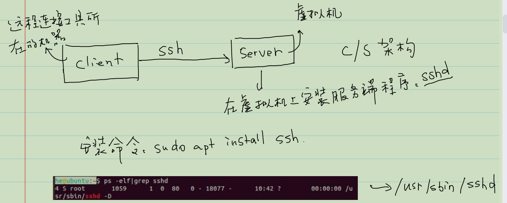

## 虚拟机上两种网络设置

在VMware Workstation应用程序下，在最左侧一栏，右键点击你想要进行网络配置的系统————>设置————>网络适配器————>网络连接。

在网络连接下有两种常用的设置，（1）桥接模式，（2）NAT模式。

我们需要使用其中的一种。对于这两种模式的区别如下：



## 设置静态ip地址

为什么要设置静态ip地址？目的是为了后续连接xshell时不用频繁因为ip改变问题而重新输入ip地址。

首先，我们在虚拟机中打开系统，这里以ubuntu系统为例，这里我们下载的镜像是带有图形化界面的。打开之后，在屏幕的右上角找到网络连接标志。按如下步骤操作：


此时配置完毕之后，我们可以打开命令行窗口进行测试网络，可以进行测试。如果ping不通的话，可以重启虚拟机。

```
ping www.baidu.com
```

## 远程连接xshell

网络配置完毕之后，我们可以使用xshell进行远程连接我们的虚拟机了，然后可以在命令行中使用命令来操控我们的系统。


这个是远程连接ssh协议的作用

